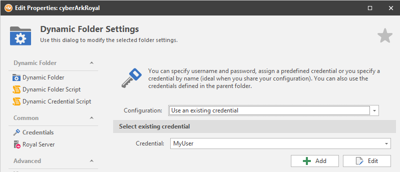
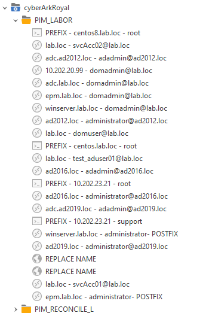
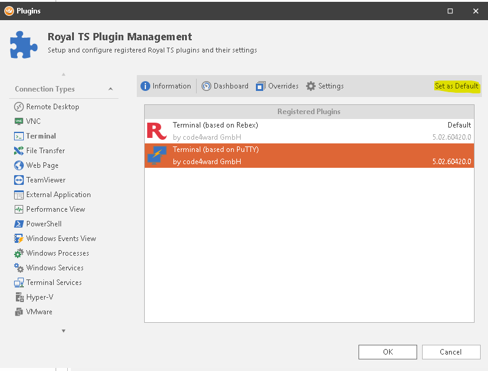

# RoyalTS Dynamic Folder for CyberArk PAS


- [RoyalTS Dynamic Folder for CyberArk PAS](#royalts-dynamic-folder-for-cyberark-pas)
  - [Overview](#overview)
  - [Requirements](#requirements)
  - [Setup ServerSide](#setup-serverside)
    - [Place ServerSide script and define data folder](#place-serverside-script-and-define-data-folder)
    - [Configure audit user](#configure-audit-user)
      - [Store password as secure string file with key](#store-password-as-secure-string-file-with-key)
    - [Run the ServerSide script as scheduled Task](#run-the-serverside-script-as-scheduled-task)
    - [ServerSide script parameters](#serverside-script-parameters)
    - [ServerSide logs](#serverside-logs)
  - [Setup ClientSide](#setup-clientside)
    - [RoyalTS Dynamic Folder](#royalts-dynamic-folder)
    - [ClientSide script switches](#clientside-script-switches)
    - [ClientSide script settings](#clientside-script-settings)
      - [Platform Mappings](#platform-mappings)
    - [Use AD groups instead of Safes API Query](#use-ad-groups-instead-of-safes-api-query)
  - [RoyalTS recommended settings](#royalts-recommended-settings)
  - [Known limitations](#known-limitations)

## Overview

The RoyalTS integration with CyberArk PAS provides a server and a client side.
The server side provides a prefetched list of safes and accounts.
The client side provides a powershell script for a "Dynamic Folder" in RoyalTS which creates all connection entries based on the safes and account the client user hase access to.

## Requirements

- CyberArk PAS v10.x or greater
- PowerShell v3 or greater
- RoyalTS v5.0 or greater (v5.1+ with Web AutoForm Login entries)
- CyberArk PSM for RDP which allow to connect RDP directly (with or without NLA) - see [CyberArk PSM documentation](https://docs.cyberark.com/Product-Doc/OnlineHelp/PAS/Latest/en/Content/PASIMP/PSSO-ConnectingDirectly.htm)
- A Webserver that can provide the server side prefetched list (e.g. use an IIS from a PVWA component server)
- Domain Accounts in CyberArk must provide their Targets in the "RemoteMachineAddress" attribute

## Setup ServerSide

The Server Side part generates a list of safes and accounts.
Because the WebAPI call to list all accounts in all your accessable safes can take its time, it will be much faster to use a pre-fetched list.
This gives an overall better user experience.

### Place ServerSide script and define data folder

Place the ServerSide PowerhSell script cyberarkSafeAccountList.ps1 with the "log" folder somewhere like **C:\Scripts** and define a data folder to write the safeaccountlist to like **C:\CyberArk\ScriptData**

### Configure audit user

Define an audit user or take the builtin cyberark "Auditor"
Put the user password into a key encrypted PowerShell secure string file. The key makes it possible to decrypt this secure string also within a scheduled Task and the executing user.

It could be a good practice to use AAM Credential Provider to retreive the audit user password instead of define a secure string file.

#### Store password as secure string file with key

Create a AES key

```powershell
$Key = New-Object Byte[] 32
[Security.Cryptography.RNGCryptoServiceProvider]::Create().GetBytes($Key)
$Key | out-file C:\Scripts\keys\secret.key
```

Write the API password (here as "yourPassword") into a secure string file with the provided key

```powershell
"yourPassword" | ConvertTo-SecureString -AsPlainText -Force | ConvertFrom-SecureString -Key (get-content "C:\Scripts\keys\secret.key") | Set-Content "C:\Scripts\secret.ini"
```

Use it within the serverSide script

```powershell
# Secrets for CyberArk Auditor user or an user in Auditors group to read all safes and accounts
$ApiUsername = "Auditor"
$ApiPasswordFile = "C:\scripts\secret.ini"
$ApiPasswordKey = "C:\scripts\keys\secret.key"
```

### Run the ServerSide script as scheduled Task

Run the server side script as an scheduled task to retrieve the safes and accounts periodically.
Take the **cyberArkSafeAccountList.xml** as a template for the scheduled task.

### ServerSide script parameters

| Parameter       | Values                       | Description                                                                                                                                 |
| --------------- | ---------------------------- | ------------------------------------------------------------------------------------------------------------------------------------------- |
| pvwaUrl         | "https://PVWA/PasswordVault" | Base URL of the PVWA where the script will use the API to retrieve all safes and accounts                                                   |
| filePath        | "c:\path\file.json"          | Full path where the safes and accounts list JSON will be stored                                                                             |
| apiUsername     | "Auditor"                    | CyberArk (internal) API user with auditor permissions or read/list permissions to all required safes and accounts to generate the list from |
| apiPasswordFile | "C:\scripts\secret.ini"      | Secure String password file                                                                                                                 |
| apiPasswordKey  | "C:\scripts\keys\secret.key" | Secure String key file to decrypt the password file                                                                                         |
| debugOn         | boolean $true or $false      | Provides console output if scripts executed in console and writes more details in logfile and event logs                                    |

### ServerSide logs

The script with the Log-Module provides some log information in the same scriptfolder where it is executed with %scriptName%.log and Event-Logs under 'Windows Logs\Windows PowerShell'

## Setup ClientSide

Prepare the ClientSide script with the necessary paramaters, see [Link to Header](#ClientSide-script-switches) and  [Link to Header](#ClientSide-script-settings)

### RoyalTS Dynamic Folder

To use the script in RoyalTS, create a new dynamic folder:


Set the Dynamic Folder Script Interpreter to  **PowerShell** and paste in the ClientSide script


Setup a Credential object for your CyberArk PVWA User in RoyalTS and use it as Credentials in the Dynamic Folder so the script will be able to login on to the PVWA API (not in _groupBasedMode_ or _allAccountsMode_)



Once applied, the Dynamic Folder Script will be executed when **Reloading** the Dynamic Folder


Based on the mode, platform mapping, access permissions and other settings the script should create connection entries in the Dynamic Folder:



### ClientSide script switches

Switches on the script to run in different modes

| Parameter           | Values                                 | Description                                                                                                                                                                                                                                                                                                                                                                                                                                                              |
| ------------------- | -------------------------------------- | ------------------------------------------------------------------------------------------------------------------------------------------------------------------------------------------------------------------------------------------------------------------------------------------------------------------------------------------------------------------------------------------------------------------------------------------------------------------------ |
| safeFilter          | boolean $true or $false                | Enables (true) or disables (false) a safe filtering based on the **safeFilterRegex** parameter. If enabled, the script creates only connection entries from safes where the name matches the regex                                                                                                                                                                                                                                                                       |
| safeFilterRegex     | string (RegEx in PS)                   | Regular Expression to match a safe name. A regex like _".\*domain.\*"_  will match e.g. a safe with name "WinDomainAccounts"                                                                                                                                                                                                                                                                                                                                                  |
| groupBasedMode      | boolean $true or $false                | Enables (true) or disables (false) the group based mode. This mode will take the actual executing domain user from \$env:username and queries the Active Directory for direct group memeberships distinguishedNames. If enabled, the script creats only connetion entries from safes where the name matches a corresponding user group, taken from the first match group in the defined regex **groupBasedSafeRegex** parameter. This mode does not require a PVWA login |
| groupBasedSafeRegex | string (RegEx in PS)                   | Regular Expression to match a safe name as the first match group. A regex like _"CN=.\*-(.+-WinDomain.+)-Users,OU=.\*"_ will match e.g. a safe with name "T0-WinDomainAccounts" from a group DN like _"CN=rolePrefix-T0-WinDomainAccounts-Users,OU=pam,DC=domain,DC=loc"_                                                                                                                                                                                                      |
| allAccountsMode     | boolean $true or $false                | Will create connection entries from all accounts which exist in the safes and accounts list. This mode does not require a PVWA login                                                                                                                                                                                                                                                                                                                                     |
| webSettingsUrl      | "https://WebServer/Data/settings.json" | Will take all settings for the client side script from a central stored JSON instead of locally defined in the PS script. Leave empty to take the locally defined settings                                                                                                                                                                                                                                                                                               |
| debugOn             | boolean $true or $false                | switch debug mode on, can be used only directly in powershell, cannot be used in RoyalTS dynamic folder                                                                                                                                                                                                                                                                                                                                                                  |

### ClientSide script settings

Script settings in JSON format which can be defined within the script or taken from a URL

| Parameter             | Values                                                                          | Description                                                                                                                                                                                                                                                                                                                                                              |
| --------------------- | ------------------------------------------------------------------------------- | ------------------------------------------------------------------------------------------------------------------------------------------------------------------------------------------------------------------------------------------------------------------------------------------------------------------------------------------------------------------------ |
| pvwaUrl               | "https://PVWA/PasswordVault"                                                    | PVWA URL used for the API login with the executing user (not relevant in groupBasedMode or allAccountsMode)                                                                                                                                                                                                                                                              |
| dataUrl               | "https://WebServer/ScriptData/cyberArkSafeAccountList.json"                     | URL where the safes accounts list JSON file can be retrieved                                                                                                                                                                                                                                                                                                             |
| authMethod            | LDAP/RADIUS/CyberArk                                                            | Defines the API authentication Method for the user to authenticate against the PVWA (not relevant in groupBasedMode or allAccountsMode)                                                                                                                                                                                                                                  |
| psmRdpAddress         | "psm.domain.local"                                                              | PSM for RDP Server address FQDN/IP to take for the created RDP connection entries                                                                                                                                                                                                                                                                                        |
| psmSshAddress         | "psmp.domain.local"                                                             | PSM for SSH Server address FQDN/IP to take for the created SSH connection entries                                                                                                                                                                                                                                                                                        |
| psmWebAddress         | "psmw.domain.local"                                                             | PSM for Web (formerly PSM for Cloud) Server address FQDN/IP to take as Forward Proxy for the created Web connection entries                                                                                                                                                                                                                                              |
| psmWebPort            | 8080                                                                            | PSM for Web Proxy Port to be used (default 80, 443 or 8080)                                                                                                                                                                                                                                                                                                              |
| useWebPluginWin       | "", "f008c2f0-5fb3-4c5e-a8eb-8072c1183088"                                      | If not empty then this RoyalTS Windows Plugin ID will be taken as "Browser Engine" for Web connection entries. Also possible to just use Default Settings in RoyalTS                                                                                                                                                                                                     |
| folderCreation        | none, safe.name, safe.description, safe.name-description, safe.description-name | Will creates folder for all connection entries based on the provided naming scheme: **none** will create no folders, **safe.name** will create folder based on the safe name the accounts are in, **safe.description** from the safe description, **safe.name-description** from safe name + description and **safe.description-name** from safe description + safe name |
| entryName             | simple, named, full                                                             | Connection Entry name which can be **simple** and only has the "address" as entry name, **named** as "username@address" and **full** as "target - username@address" for domain users                                                                                                                                                                                     |
| credentialsFromParent | boolean 1 or 0                                                                  | Will reate the connection entries with "credential" set to "take from parent folder"                                                                                                                                                                                                                                                                                     |
| enableNLA             | boolean 1 or 0                                                                  | Enables NLA in RDP connection entries                                                                                                                                                                                                                                                                                                                                    |
| excludeAccounts       | string array["user1","user2"]                                                   | Excludes these accounts / usernames from creating any connection entries                                                                                                                                                                                                                                                                                                 |

#### Platform Mappings

Platform Mapping is required to match certain CyberArk Platform for accounts to a specific connection entry in RoyalTS.
As platforms can be rather different and customized, the platformMappings provides the necessary parameters to create connections properly.
The platformMappings entry is a dictionary of Platform-ID as unique Key and a Dictionary of parameters as Values

| Parameter           | Values                                                     | Description                                                                                                                                                                     |
| ------------------- | ---------------------------------------------------------- | ------------------------------------------------------------------------------------------------------------------------------------------------------------------------------- |
| royalTsConnection   | SSH, RDP, WEB                                              | Conection entry type, only SSH, RPD and WEB are supported                                                                                                                       |
| accountType         | local, domain                                              | Defines if an account is local "username -> address" oder domain with "username@logonDomain -> RemoteMachineAdress as target" in the connection entry "psm /a and /t parameter" |
| connectionComponent | string of connectionComponent to use like PSM-RDP, PSM-XYC | The connection Component of the platform which should be used to create the connection entry "psm /c parameter"                                                                 |
| replaceName         | string                                                     | Replaces the connection entry name entirely with this value                                                                                                                     |
| namePrefix          | string                                                     | Prefix in the connection entry name                                                                                                                                             |
| namePostfix         | string                                                     | Postfix in the connection entry name                                                                                                                                            |
| webProtocol         | https/https                                                | only used in PSM for Web connection entries as target address protocol to use. Target address are mostly only an IP or FQDN                                                     |
| webInputObject      | string                                                     | used as Input Form object where the conneciont entry will fill in "yourUsername:accountUsername" for the PSM for Web Proxy process                                              |

Example of a platform mapping

```powershell
    "platformMappings": {
        "UnixSSH": {
            "royalTsConnection": "SSH",
            "accountType": "local"
        },
        "WindowsDomain": {
            "royalTsConnection": "RDP",
            "accountType": "domain",
            "connectionComponent": "PSM-RDP"
        },
        "ExchangeDomainUser": {
            "royalTsConnection": "RDP",
            "accountType": "domain",
            "connectionComponent": "PSM-WebApp-Exchange-EPC"
        },
        "WindowsServerLocal": {
            "royalTsConnection": "RDP",
            "accountType": "local",
            "connectionComponent": "PSM-RDP"
        },
        "AzureWebAccount":{
            "replaceName": "",
            "namePrefix": "Azure - ",
            "namePostfix": "",
            "royalTsConnection": "WEB",
            "accountType": "local",
            "webProtocol": "https",
            "webInputObject": 'input#i0116'
        }
    }
```

### Use AD groups instead of Safes API Query

With the _groupBasedMode_ it is possible to use AD groups instead of PVWA access permissions to find out which safes and accounts the user has access to.
The script takes the $env:username from the domain joined windows client where RoyalTS is running and fetched all group memberships of this user from AD.
Groups DN's are compared with the _groupBasedSafeRegex_ and if a Group DN matches the first regex match group (1) should match exactly with a safe name in CyberArk.

An expression like

```powershell
$groupBasedSafeRegex = "CN=.*?CyberArk-(.*)-[M|U],OU=.*"
```

would match a group DN like: **CN=RolegroupsXY-CyberArk-T1_TestApp-M,OU=PAM,OU=Groups,DC=LAB,DC=LOC**
And the first match group results as: **T1_TestApp**
If there is a safe with name **T1_TestApp** then the script will create connection entries based on match

## RoyalTS recommended settings

Use Putty as Default SSH Plugin is recommended



Use Chrome as Default Web Engine Plugin is recommended


Change Default settings for each created connection in a Dynamic Folder with the **Default Settings** for Applications:


RDP Settings like Key Passthrough (fetch key combinations e.g. ALT+TAB in the RDP session) will be set on the RDP connection entries based on this default settings


## Known limitations

- SAML auth method for PVWA will not work, apply a groupBasedMode or allAccountsMode
- MFA auth method like RADIUS with a Challenge (OTP/mTAN) for PVWA will not work (where Non-Challenge like push notification works), apply a groupBasedMode or allAccountsMode
- Multiple and different connection entries for different connection components in the same Platform cannot be used actually
- OLAC is not supported
